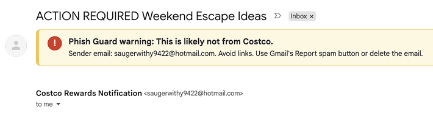
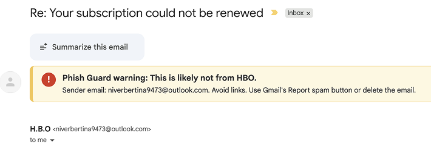
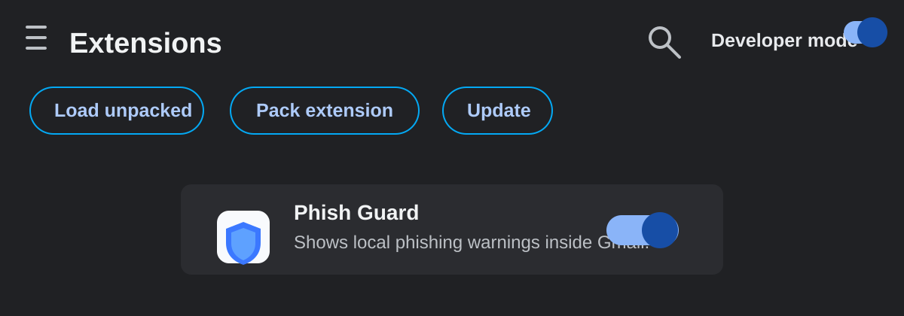

# Phish Guard



Phish Guard is a Chrome extension that warns you inside Gmail when an email looks like it is pretending to be a trusted brand.

It is built for the moment that matters: before you click a link in a suspicious message.

## Why Use It

- It shows a plain warning when the sender looks wrong.
- It explains the problem in normal language.
- It helps you pause before clicking links in fake reward, account, payment, or subscription emails.



## What It Checks

Phish Guard checks only the email you have open. It looks at:

- Who the email says it is from.
- The actual sender email address.
- The visible words and links in that open email.
- Whether a brand name and sender address look like they belong together.

It should not warn just because a friend mentions YouTube, a newsletter talks about Apple, or a normal email has social links in the footer.

## Privacy

Phish Guard runs locally in your browser.

It does **not**:

- Upload your email.
- Scan your inbox history.
- Read attachments.
- Access your contacts, cookies, or passwords.
- Visit links for you.
- Edit, delete, send, archive, label, or report emails.

Chrome may say the extension can "read and change" data on Gmail. That sounds scary, but here it means:

- **Read:** check the open message locally.
- **Change:** add the warning banner inside Gmail.

Read the full policy in [PRIVACY.md](PRIVACY.md).

## Install

Chrome Web Store link coming soon.

For now, private testing takes a few manual Chrome steps:



1. Download `phish-guard-chrome-extension.zip` from the latest GitHub release.
2. Unzip it.
3. Open `chrome://extensions`.
4. Turn on **Developer mode**.
5. Click **Load unpacked**.
6. Select the unzipped folder that contains `manifest.json`.
7. Open Gmail, click the Phish Guard toolbar icon, and turn on Gmail warnings.

For local development, see [docs/development/local-install.md](docs/development/local-install.md).

## Technical Notes

```bash
npm test
npm run eval:detector
npm run build
npm run package:chrome-extension
```

`npm run eval:detector` runs a synthetic phishing/safe-message test set. It is a regression check, not a real-world accuracy claim.

Report bugs and false positives with GitHub issues, but do not post full email bodies, attachments, private links, or private inbox screenshots. Sender display names and domains are usually enough.
