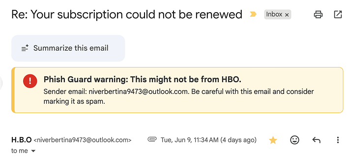

# Phish Guard



Phish Guard is a free Chrome extension that warns you inside Gmail when an email may be pretending to be a company you trust.

It runs locally on your computer, does not upload your email, and does not require an account.

## Why Install It

Spam emails often copy the names and logos of companies you know. They say a payment failed, a package is stuck, or your subscription needs attention. The goal is to make you click before you think.

Phish Guard gives you a second pair of eyes. If the sender does not match the company the email claims to be from, it shows a plain warning above the message. It stays quiet for normal email.

## Install

The current alpha uses Chrome's manual extension install flow. It is a little clunky, but it takes about two minutes.


1. [Download `phish-guard-chrome-extension.zip`](https://github.com/petergyang/phish-guard/releases/download/v0.2.5-alpha/phish-guard-chrome-extension.zip).
2. Unzip the file.
3. Open Chrome and go to `chrome://extensions`.
4. Turn on **Developer mode**.
5. Click **Load unpacked**.
6. Select the unzipped folder that contains `manifest.json`.
7. Open Gmail, click the Phish Guard toolbar icon, and choose **Turn on Gmail warnings**.

Chrome asks for `mail.google.com` access so Phish Guard can check the open message and add the warning banner. A Chrome Web Store version is planned if the alpha goes well.

If Chrome shows extension errors later, go back to `chrome://extensions`, click **Reload** on Phish Guard, and refresh Gmail.

## Privacy

Phish Guard checks only the Gmail message you have open. It looks at the sender, subject, visible words, and links in that message.

It does **not**:

- Upload your email.
- Scan your inbox history.
- Read attachments.
- Access your contacts, cookies, or passwords.
- Visit links for you.
- Edit, delete, send, archive, label, or report emails.

Read the full policy in [PRIVACY.md](PRIVACY.md).

## Contribute

Contributions are welcome. Open an issue or pull request if you spot a bug, a false positive, or a way to make Phish Guard better.

Please do not post full email bodies, attachments, private links, or private inbox screenshots. Sender names and domains are usually enough.

## Technical Notes

```bash
npm test
npm run eval:detector
npm run build
npm run package:chrome-extension
```

`npm run eval:detector` runs a synthetic phishing/safe-message test set. It is a regression check, not a real-world accuracy claim.
