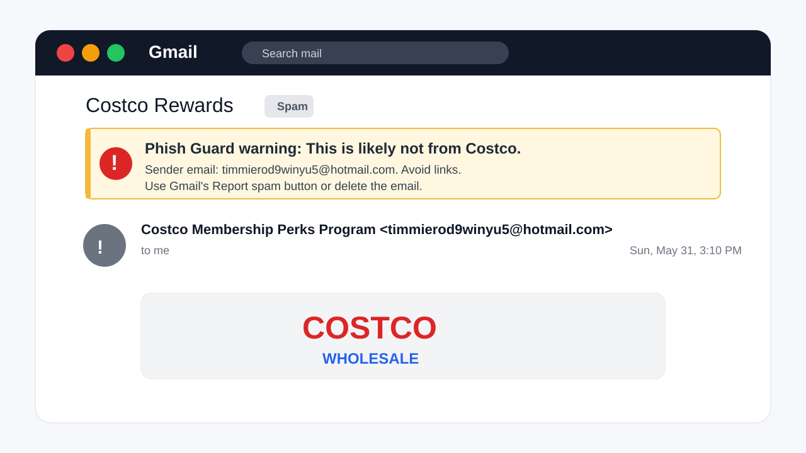

# Phish Guard



Phish Guard is a Chrome extension that warns you when a Gmail message looks like brand impersonation.

If an email says it is from Costco, YouTube, PayPal, or another recognizable organization, but the sender address is unrelated, Phish Guard shows a warning inside the message before you click.

## How It Works

1. You open a message in Gmail.
2. Phish Guard reads the visible sender row, subject, and message body text for that open email.
3. If the email appears to impersonate a brand from an unrelated sender, Phish Guard shows a warning above the message header.

Phish Guard runs locally in your browser and does not upload email data.

## What It Checks

- Sender display name
- Sender email address and domain
- Subject and visible body text in the open message
- Link URLs and visible link text in the open message
- Obvious brand mismatch signals
- Link domains that do not match the claimed brand
- URL shorteners in brand-like messages
- Subscription, payment, account, and urgency language
- Known high-confidence brands like Google, YouTube, PayPal, Apple, Microsoft, and Costco
- Generic organization-style names, such as `Costco Rewards Connection`

It should not warn just because a friend casually mentions a brand. Body checks look for brand claims together with scam-like context such as subscription, payment, account, or urgency language.

## Warning Copy

```text
Phish Guard warning: This is likely not from Costco.
Sender email: random@hotmail.com. Avoid links. Use Gmail's Report spam button or delete the email.
```

The warning is intentionally plain. It tells you what looks wrong and what to do next.

## Install

Chrome Web Store link coming soon.

For local development and private testing, see [docs/development/local-install.md](docs/development/local-install.md).

## Privacy

Phish Guard reads the visible sender row, subject, and body text for the open Gmail message. It uses that data locally to decide whether to show a warning.

It does not read:

- Attachments
- Inbox history
- Contacts
- Cookies
- Passwords

It does not visit links or upload link URLs.

Chrome may say Phish Guard can "read and change" data on Gmail. The "read" part is for inspecting the open message locally. The "change" part is for adding the warning banner. Phish Guard does not edit, delete, send, archive, label, or report emails.

Read the full policy in [PRIVACY.md](PRIVACY.md).

## Development

```bash
npm test
npm run eval:detector
npm run build
npm audit --audit-level=moderate
npm run package:chrome-extension
```

Project layout:

- `apps/chrome-extension`: Consumer-facing Chrome extension
- `packages/detector`: Local sender-risk detector
- `packages/detector/fixtures/corpus`: Synthetic detector evaluation corpus
- `apps/gmail-addon`: Earlier Gmail add-on experiment
- `docs/development`: Local development and private testing notes
- `docs/privacy`: Privacy and permission notes
- `docs/store`: Chrome Web Store and release-readiness notes

## Reporting Issues

Use GitHub issues for bugs and false positives. Do not post full email bodies, attachments, private links, or screenshots that reveal personal messages. Sender display names and sender domains are usually enough.

Security and privacy reports should follow [SECURITY.md](SECURITY.md).
