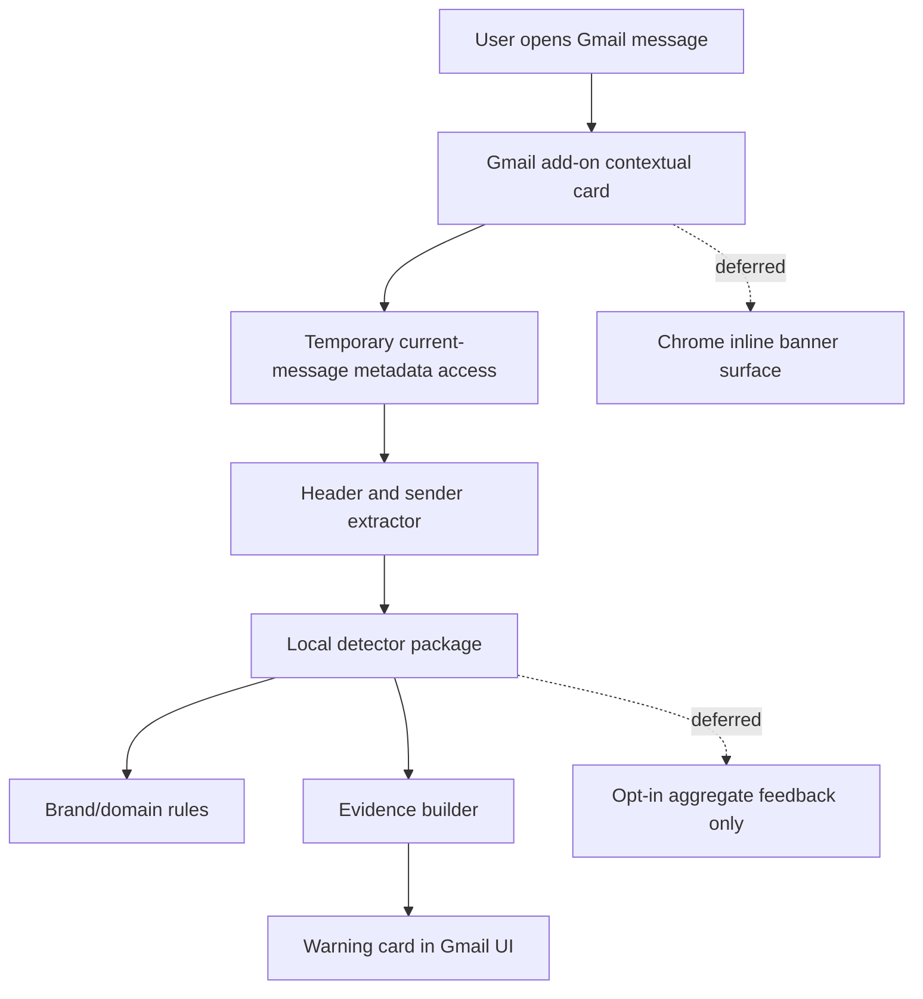
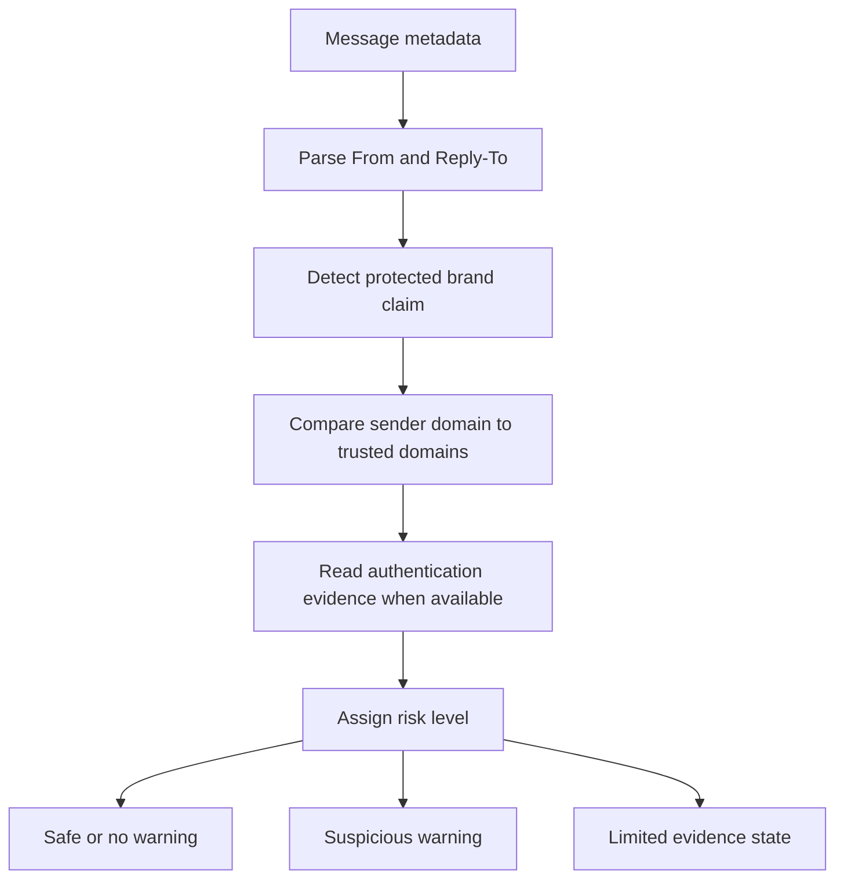

# feat: Plan privacy-safe email phishing warnings

## Summary

Build a privacy-safe Gmail anti-phishing MVP that warns when a message presents itself as a trusted brand but the visible sender address, domain, or available authentication evidence does not support that identity. The recommended starting architecture is a Google Workspace Gmail add-on with current-message metadata access, backed by local rules and a fixture-based detector package; Chrome extension and backend-scanning options remain documented alternatives rather than the MVP path.

---

## Problem Frame

The user wants protection at the moment they open an email, especially for messages whose display name claims a trusted service like YouTube while the actual sender is a random Gmail account or unrelated domain. The product must not become a privacy problem by reading entire inboxes or uploading email contents to a server.

The repo is currently greenfield, so this plan defines the initial architecture, package shape, privacy boundaries, and verification strategy. The plan compares multiple implementation surfaces and lands on the least-privilege path that still places a warning close to the open message.

---

## Requirements

**Privacy and permissions**

- R1. The MVP must inspect only the currently opened Gmail message, not scan the user's inbox in bulk.
- R2. The MVP must avoid reading message bodies, attachments, and links unless a later permission tier is explicitly designed.
- R3. The MVP must run sender-risk detection without sending email content or sender metadata to an external service by default.
- R4. The MVP must make requested Google or browser permissions legible in docs and user-facing copy.

**Detection**

- R5. The detector must parse the display name, mailbox address, sender domain, reply-to domain, and selected RFC headers when available.
- R6. The detector must flag protected-brand impersonation when a trusted brand appears in the display name or subject context but the sender domain is unrelated.
- R7. The detector must prefer evidence-based warnings over binary accusations, showing why a message is suspicious.
- R8. The detector must support allowlisted brand domains and common subdomain patterns without hard-coding all logic into the UI layer.

**User experience**

- R9. The warning must appear when the user is reading a Gmail message and the add-on is active.
- R10. The UI must distinguish safe, suspicious, and limited-evidence states.
- R11. The UI must let the user inspect the specific signal, such as "display name says YouTube; sender domain is gmail.com."

**Product boundaries**

- R12. The MVP must compare Gmail add-on, Chrome extension, Gmail API/backend scanner, enterprise gateway, and hybrid approaches before committing to implementation.
- R13. The first implementation must target consumer Gmail / Google Workspace Gmail reading flow, not enterprise mail routing or non-Gmail clients.
- R14. The plan must leave room for later detection tiers without requiring the MVP to request restricted broad-mailbox scopes.

---

## Key Technical Decisions

- KTD1. Start with a Gmail add-on, not a Chrome extension: Gmail add-ons support UI while reading Gmail messages and offer a current-message metadata scope designed for narrower access. This better matches the product's privacy promise than a DOM-injecting extension that can inspect rendered email content.
- KTD2. Keep the detector platform-neutral: sender parsing, brand matching, risk scoring, and explanation building should live in a TypeScript package that can be tested with fixtures and later reused by a Chrome extension or backend scanner.
- KTD3. Use metadata-only analysis for MVP warnings: the first detector tier should operate on `From`, `Reply-To`, `Subject`, and selected authentication headers where the platform permits access. Body, link, attachment, image, and OCR analysis are deferred.
- KTD4. Treat authentication evidence as supporting context, not the only signal: DMARC alignment is strong evidence when available, but a user-facing warning for "YouTube name from random Gmail" can be justified from display-name/domain mismatch alone.
- KTD5. Explain warnings as evidence: the UI should avoid "this is phishing" language and instead show the mismatch and confidence level, reducing false-positive harm for legitimate delegated senders.
- KTD6. Make permission escalation explicit: any future move to Gmail API `gmail.metadata`, `gmail.readonly`, Chrome host permissions, or backend analysis must become a new tier with its own consent, docs, and threat-model update.

---

## Architecture Options Compared

| Option | Privacy posture | UX fit | Detection depth | Permission/review risk | MVP verdict |
|---|---|---|---|---|---|
| Gmail add-on with current-message metadata | Strong: temporary access to open message metadata | Good: side-panel/card UI while reading messages | Medium: sender, subject, selected headers depending on runtime access | Medium: sensitive add-on metadata scope, but narrow | Recommended |
| Chrome extension on `mail.google.com` | Medium: can be limited to Gmail host, but DOM access can expose message contents | Strong: can place inline banners near sender | Medium-high: can inspect rendered page and maybe DOM details | Medium-high: host/content-script warnings and trust concerns | Prototype later only if add-on UX is insufficient |
| Gmail API/backend scanner | Weak for MVP: broad mailbox metadata or content access, server-side storage risk | Weak-medium: can label or notify but not naturally "when opened" | High: headers, history, batch analysis | High: restricted scopes, verification, data policy burden | Defer |
| Enterprise mail gateway / admin integration | Strong for organizations if deployed before delivery | Weak for consumer Gmail; not open-message UX | High: full SMTP/header context | High: enterprise sales/admin setup | Not MVP |
| Hybrid add-on plus optional local Chrome banner | Medium-strong if add-on owns data and extension only renders state | Strong | Medium | High complexity across two surfaces | Later, after proving detector value |

---

## High-Level Technical Design





---

## Output Structure

```text
apps/
  gmail-addon/
    appsscript.json
    src/
      cards/
      gmail/
      index.ts
packages/
  detector/
    src/
      brand-rules.ts
      email-address.ts
      evidence.ts
      risk-score.ts
    fixtures/
    tests/
docs/
  privacy/
    threat-model.md
    permissions.md
  plans/
```

The final layout may adapt to the build tool selected during implementation, but the separation between Gmail surface, detector logic, fixtures, and privacy docs should remain.

---

## Implementation Units

### U1. Define the privacy and permission contract

**Goal:** Establish the MVP's data boundary before implementation.

**Requirements:** R1, R2, R3, R4, R6, R14

**Dependencies:** None

**Files:**

- `docs/privacy/threat-model.md`
- `docs/privacy/permissions.md`
- `docs/privacy/test-cases.md`

**Approach:** Document what data the MVP may read, what it must not read, and how permission tiers differ. Include a compact threat model covering malicious extension/add-on compromise, accidental body capture, server exfiltration, false positives, and user trust failures.

**Patterns to follow:** Use clear product language rather than legalese; treat privacy promises as implementation constraints.

**Test scenarios:**

- Test expectation: none -- documentation unit, but reviewers should verify the docs map every requested permission to a user-visible purpose.

**Verification:** A reader can tell exactly which message fields are allowed in the MVP and which future features require a new consent tier.

### U2. Create the detector package and fixture model

**Goal:** Build a platform-neutral detector contract that can classify sender impersonation from metadata fixtures.

**Requirements:** R5, R6, R7, R8, R10, R11

**Dependencies:** U1

**Files:**

- `packages/detector/src/email-address.ts`
- `packages/detector/src/brand-rules.ts`
- `packages/detector/src/evidence.ts`
- `packages/detector/src/risk-score.ts`
- `packages/detector/fixtures/youtube-gmail-impersonation.json`
- `packages/detector/fixtures/google-legit-subdomain.json`
- `packages/detector/fixtures/delegated-sender-limited-evidence.json`
- `packages/detector/tests/email-address.test.ts`
- `packages/detector/tests/risk-score.test.ts`

**Approach:** Represent each message as normalized metadata: raw `From`, parsed display name, parsed address, sender domain, reply-to domain, subject, optional selected headers, and provider/source. Return a risk level plus evidence items instead of a single boolean.

**Execution note:** Implement detector behavior test-first using fixture cases before wiring it to Gmail.

**Patterns to follow:** Keep parsing and scoring pure so no Gmail APIs are called from detector tests.

**Test scenarios:**

- Happy path: display name contains "YouTube" and sender address is a personal Gmail account; detector returns suspicious with display-name/domain mismatch evidence.
- Happy path: display name contains "YouTube" and sender domain is an allowed Google/YouTube domain; detector returns safe or low risk.
- Edge case: display name is empty and sender domain is unknown; detector returns limited evidence rather than suspicious.
- Edge case: internationalized or quoted display names parse without losing the actual mailbox domain.
- Error path: malformed `From` header is classified as limited evidence with a parsing issue, not as safe.
- Integration scenario: brand rules feed the scorer and explanation builder so a new protected brand can be added without editing Gmail UI code.

**Verification:** Fixture tests demonstrate that the example attack from the request produces a warning and legitimate trusted-domain examples do not.

### U3. Build the Gmail add-on message surface

**Goal:** Show a Gmail card when a user opens a message with the add-on active.

**Requirements:** R1, R2, R4, R5, R9, R10, R11

**Dependencies:** U1, U2

**Files:**

- `apps/gmail-addon/appsscript.json`
- `apps/gmail-addon/src/index.ts`
- `apps/gmail-addon/src/gmail/current-message.ts`
- `apps/gmail-addon/src/cards/warning-card.ts`
- `apps/gmail-addon/tests/current-message.test.ts`
- `apps/gmail-addon/tests/warning-card.test.ts`

**Approach:** Configure a Gmail contextual trigger with the narrow current-message metadata scope. The message adapter should extract only approved fields and pass normalized metadata to the detector package. The card should render safe, suspicious, and limited-evidence states.

**Execution note:** Characterize the exact Gmail add-on metadata and header access available in the chosen Apps Script or HTTP runtime before expanding any requested scope.

**Patterns to follow:** Keep Gmail runtime code thin; no scoring logic should live in card rendering.

**Test scenarios:**

- Happy path: mocked current-message event with a suspicious sender renders a warning card with the mismatch evidence.
- Happy path: mocked current-message event with a trusted sender renders a quiet/safe card.
- Edge case: add-on receives no optional authentication header values; card shows limited evidence if the domain/display-name signal is insufficient.
- Error path: missing access token or message ID returns a privacy-preserving error card without logging message contents.
- Integration scenario: Gmail adapter passes only allowlisted fields into the detector and never body, attachment, or link content.

**Verification:** Local tests prove the add-on adapter is metadata-only, and a manual Gmail add-on test shows a card appears for an open message.

### U4. Add brand rule management for the MVP allowlist

**Goal:** Provide a maintainable rule source for protected brands and allowed sending domains.

**Requirements:** R6, R8, R11, R14

**Dependencies:** U2

**Files:**

- `packages/detector/src/brand-rules.ts`
- `packages/detector/src/domain-match.ts`
- `packages/detector/fixtures/brand-rules.json`
- `packages/detector/tests/brand-rules.test.ts`
- `docs/privacy/brand-rule-policy.md`

**Approach:** Start with a small curated set of high-risk brands and domains. Domain matching should support exact domains and subdomains while avoiding broad substring matches that let attacker domains pass.

**Patterns to follow:** Rules should be data-first and reviewable, not scattered conditionals.

**Test scenarios:**

- Happy path: `accounts.google.com` and `youtube.com` match the Google/YouTube allowlist.
- Edge case: `youtube.com.attacker.example` does not match the YouTube allowlist.
- Edge case: `mail.paypal.com` can be allowed without allowing unrelated lookalike domains.
- Error path: invalid rule entries fail validation before runtime.
- Integration scenario: updating the fixture rule list changes detector behavior without modifying the scorer.

**Verification:** Rule tests prove exact/subdomain handling and prevent common lookalike bypasses.

### U5. Document and defer non-MVP architectures

**Goal:** Preserve option analysis so future work can revisit Chrome, backend, and enterprise paths without redoing the tradeoff from scratch.

**Requirements:** R12, R13, R14

**Dependencies:** U1

**Files:**

- `docs/privacy/architecture-options.md`
- `docs/privacy/chrome-extension-follow-up.md`
- `docs/privacy/backend-scanner-follow-up.md`
- `docs/privacy/enterprise-gateway-follow-up.md`

**Approach:** Record why Gmail add-on is the MVP, what would make Chrome extension worth prototyping, what restricted-scope burdens a backend scanner introduces, and what enterprise gateway work would require.

**Patterns to follow:** Keep alternatives practical: each deferred path should include the trigger that would make it worth pursuing.

**Test scenarios:**

- Test expectation: none -- documentation unit, but review should verify every deferred architecture has a clear "choose this when" condition.

**Verification:** The docs explain the option comparison in product and technical terms, including privacy and permission implications.

### U6. Add smoke-test fixtures and manual verification checklist

**Goal:** Give implementers and reviewers a repeatable way to verify the MVP without using real private emails.

**Requirements:** R1, R2, R3, R6, R7, R9, R10, R11

**Dependencies:** U2, U3, U4

**Files:**

- `packages/detector/fixtures/README.md`
- `apps/gmail-addon/tests/privacy-boundary.test.ts`
- `docs/privacy/manual-verification.md`

**Approach:** Use synthetic fixture messages for automated tests and a manual checklist for Gmail add-on behavior. The checklist should include what screenshots or observations prove without exposing real mailbox contents.

**Patterns to follow:** Prefer synthetic messages and local fixtures over live inbox examples.

**Test scenarios:**

- Happy path: synthetic YouTube impersonation fixture triggers the same evidence in detector and add-on card tests.
- Edge case: synthetic legitimate sender fixture stays quiet across detector and add-on layers.
- Error path: privacy-boundary test fails if body-like fields are included in the metadata handoff.
- Integration scenario: manual checklist confirms the add-on displays when opening a Gmail message and does not require broad Gmail API scopes.

**Verification:** A reviewer can validate the MVP against synthetic data and a Gmail add-on install without sharing private email content.

---

## Scope Boundaries

### In Scope

- Gmail reading-flow MVP using current-message metadata.
- Sender display-name, address, domain, reply-to, and selected header analysis.
- Local detector rules and evidence-based warnings.
- Synthetic fixtures and privacy-boundary tests.
- Documentation of architecture alternatives.

### Deferred to Follow-Up Work

- Inline Chrome extension banner on top of Gmail's message view.
- Body, link, attachment, image, QR-code, or OCR analysis.
- Server-side scoring, centralized telemetry, or model-based classification.
- Gmail label automation, inbox-wide monitoring, or background scans.
- Enterprise gateway, Google Workspace admin controls, SIEM integrations, or managed policy rollout.
- Non-Gmail clients such as Outlook, Apple Mail, and mobile-only IMAP flows.

### Outside This Product's Identity

- Replacing Gmail's native spam/phishing classifier.
- Guaranteeing that a suspicious message is malicious.
- Reading private email content to provide broad AI summaries.

---

## Risks & Dependencies

- **Header availability risk:** Gmail add-on metadata access may not expose every authentication header needed for DMARC-style evidence. Mitigation: treat headers as optional, verify current runtime behavior in U3, and avoid requesting broad Gmail API scopes for the MVP.
- **False-positive risk:** Legitimate brands often use subdomains, delegated senders, or campaign platforms. Mitigation: evidence-based copy, small allowlists, limited-evidence state, and fixtures for delegated senders.
- **Permission trust risk:** Even narrow Gmail scopes can sound sensitive to users. Mitigation: permission docs, no backend upload by default, and a clear field-level privacy boundary.
- **UX visibility risk:** Gmail add-ons appear in a side panel/card, not necessarily an inline banner next to the sender. Mitigation: validate whether the add-on UI is noticeable enough before considering a Chrome extension.
- **Rules maintenance risk:** Brand/domain allowlists can become stale. Mitigation: data-driven rules with validation tests and documented update policy.

---

## Documentation / Operational Notes

- Publish the privacy boundary before public testing so users understand what the add-on can and cannot read.
- Keep fixture examples synthetic; do not commit real email headers from a user's mailbox.
- Add a future consent review before any feature requests broader Gmail API scopes or Chrome host/content-script access.
- If telemetry is added later, make it opt-in and aggregate-only; the MVP should not need telemetry to function.

---

## Sources & Research

- Google Workspace add-on scopes: `gmail.addons.current.message.metadata` grants temporary access to open-message metadata and avoids message content; `gmail.readonly` and `gmail.metadata` are broader/restricted Gmail API scopes. https://developers.google.com/workspace/add-ons/concepts/workspace-scopes and https://developers.google.com/workspace/gmail/api/auth/scopes
- Gmail add-on message UI: contextual triggers can build cards when a user opens a message while the add-on is active. https://developers.google.com/workspace/add-ons/gmail/extending-message-ui
- Gmail API message metadata: `users.messages.get` supports `format=METADATA` and selected `metadataHeaders[]`, but uses broader Gmail API scopes than the add-on current-message metadata scope. https://developers.google.com/workspace/gmail/api/reference/rest/v1/users.messages/get
- Chrome extension permissions: `activeTab` grants temporary access only after user invocation; content scripts and host permissions can inject into matching pages and may trigger user warnings. https://developer.chrome.com/docs/extensions/develop/concepts/activeTab and https://developer.chrome.com/docs/extensions/develop/concepts/declare-permissions
- DMARC and authentication evidence: DMARC checks alignment between the visible RFC5322 From domain and authenticated SPF/DKIM domains; Google documents SPF, DKIM, DMARC, and ARC as Gmail authentication signals. https://www.rfc-editor.org/rfc/rfc7489 and https://support.google.com/a/answer/81126
