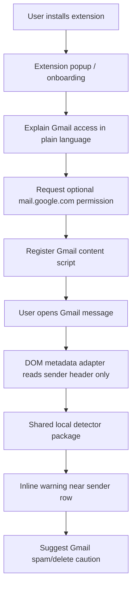
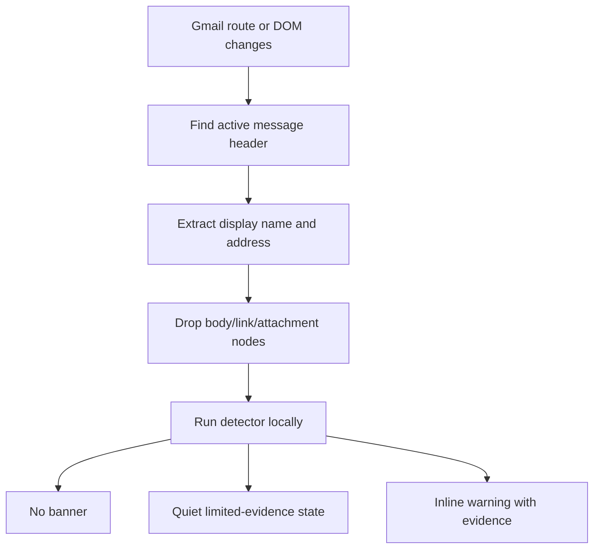

# feat: Build consumer inline Gmail phishing warnings

## Summary

Shift the consumer MVP from a Gmail add-on side panel to a Chrome extension that shows an inline warning in the Gmail message view. Preserve the existing metadata-only detector and privacy posture, but change the product surface so users can install without Google's unverified OAuth warning and see protection where their attention already is.

---

## Problem Frame

The original plan optimized for the narrowest Google Workspace add-on data boundary. That was directionally good for privacy, but live testing exposed two product failures: unverified Apps Script OAuth shows a frightening Google warning, and the add-on warning is hidden behind Gmail's right-side rail. For anti-phishing, a warning that users must remember to open is not protection; it is a diagnostic panel.

The revised plan treats install trust and warning visibility as first-order requirements. The Chrome extension path has a broader browser permission surface than the add-on, so the plan uses optional Gmail-only host permission, local-only detection, DOM boundary tests, and prominent permission copy to keep the privacy promise understandable.

---

## What Was Wrong With The Original Plan

- It assumed "side-panel/card UI while reading messages" was good enough. Real Gmail usage shows users may never open the right rail, so the warning misses the decision moment.
- It treated OAuth verification as a launch checklist item, but the unverified warning blocks realistic consumer testing today.
- It ranked privacy posture above user comprehension. A narrower permission that produces a scarier Google screen is not automatically more trustworthy to a normal user.
- It deferred the Chrome extension until after proving the add-on UX, but the add-on UX has already failed the user's stated bar.

---

## Requirements

**Install and trust**

- R1. Users must be able to install the MVP without seeing Google's unverified OAuth app warning.
- R2. Any browser permission prompt must be preceded by plain-language product copy explaining why Gmail access is needed.
- R3. The extension must request access only for `https://mail.google.com/*`, not `<all_urls>` or unrelated sites.
- R4. The Chrome Web Store listing, onboarding, and privacy policy must all state the same data boundary.

**Warning experience**

- R5. When a user opens a suspicious Gmail message after enabling Gmail protection, the warning must appear inline near the sender/message header.
- R6. The warning must explain the mismatch in human terms, including the claimed brand and actual sender address or domain.
- R7. The warning must suggest a safe next action, such as using Gmail's spam/report controls or deleting the message, without pretending certainty.
- R8. Legitimate emails from friends or non-brand conversations must not warn merely because the subject or body mentions a brand.

**Privacy and implementation**

- R9. The detector must run locally in the browser and must not upload sender metadata or email content by default.
- R10. The MVP must read only visible sender/header metadata needed for the warning, not message body, attachments, links, or inbox history.
- R11. The existing detector package must remain platform-neutral so the Gmail add-on and Chrome extension can share scoring logic.
- R12. Any future body/link analysis, backend scoring, telemetry, or Gmail API OAuth must require a new permission review.

---

## Key Technical Decisions

- KTD1. Use a Chrome extension for the consumer MVP: inline placement is necessary for phishing protection, and avoiding Google OAuth removes the unverified Apps Script warning from the install flow.
- KTD2. Use optional Gmail host permission instead of static Gmail content-script access at install: the extension can install with fewer initial warnings, then ask the user to enable Gmail protection with product copy before Chrome's site-access prompt.
- KTD3. Inject Gmail protection only after permission grant: a service worker registers the Gmail content script when `https://mail.google.com/*` access is granted, keeping the permission boundary explicit.
- KTD4. Keep detection local and metadata-only: the content script extracts sender display name, sender address/domain, subject when visible, and derived brand signals, then calls `packages/detector`.
- KTD5. Treat Gmail DOM parsing as an adapter, not detector logic: selectors and MutationObserver behavior live in the Chrome extension package, while sender scoring remains in the detector package.
- KTD6. Keep the Gmail add-on as a verified long-term path, not the consumer MVP: Marketplace/OAuth verification remains valuable for Workspace-native trust, but it does not solve inline visibility.

---

## Architecture Options Re-ranked

| Option | Install experience | Warning visibility | Privacy posture | Revised verdict |
|---|---|---|---|---|
| Chrome extension with optional Gmail host permission | Stronger: no Google OAuth unverified screen; Gmail access requested after onboarding | Strong: inline banner near sender | Medium: Gmail DOM access, constrained by host and tests | Recommended consumer MVP |
| Verified Google Workspace Gmail add-on | Strong after Marketplace/OAuth verification | Weak-medium: right rail/card surface | Strong: current-message metadata scope | Long-term secondary path |
| Static Chrome extension content script on Gmail | Medium: likely install-time site-access warning | Strong | Medium: persistent Gmail host access | Avoid unless optional permission proves too clunky |
| Gmail API/backend scanner | Weak: OAuth and restricted-scope burden | Medium: labels/notifications, not inline open-time | Weak for MVP: server handling risk | Defer |
| Enterprise gateway | Weak for consumers | Strong before delivery, weak for personal Gmail | Strong only for org-controlled mail | Not consumer MVP |

---

## High-Level Technical Design





---

## Output Structure

```text
apps/
  chrome-extension/
    manifest.json
    src/
      background/
      content/
      popup/
      ui/
    tests/
packages/
  detector/
docs/
  privacy/
  plans/
scripts/
```

The exact build layout can adapt during implementation, but the extension must stay separate from the detector package and the Gmail add-on.

---

## Implementation Units

### U1. Reframe the product and privacy docs around consumer install

**Goal:** Make the repo's strategy match the revised consumer MVP.

**Requirements:** R1, R2, R3, R4, R12

**Dependencies:** None

**Files:**

- `README.md`
- `docs/privacy/architecture-options.md`
- `docs/privacy/chrome-extension-follow-up.md`
- `docs/privacy/permissions.md`
- `docs/privacy/threat-model.md`

**Approach:** Demote the Gmail add-on to a verified long-term path and promote the Chrome extension as the consumer MVP. Document the permission ladder: install first, then user-triggered Gmail access, then future escalations only after design review.

**Patterns to follow:** Keep the direct privacy language already used in `docs/privacy/threat-model.md`.

**Test scenarios:**

- Test expectation: none -- documentation unit, but review must verify that the install story, permissions story, and architecture recommendation no longer contradict each other.

**Verification:** A reader can understand why the plan changed and what privacy promise still holds.

### U2. Add the Manifest V3 Chrome extension shell

**Goal:** Create a Chrome extension package that can build, install locally, and share the detector package.

**Requirements:** R1, R3, R9, R11

**Dependencies:** U1

**Files:**

- `apps/chrome-extension/package.json`
- `apps/chrome-extension/manifest.json`
- `apps/chrome-extension/src/background/service-worker.ts`
- `apps/chrome-extension/src/popup/popup.html`
- `apps/chrome-extension/src/popup/popup.ts`
- `apps/chrome-extension/tests/manifest-permissions.test.ts`
- `scripts/build-chrome-extension.mjs`
- `package.json`

**Approach:** Use Manifest V3 with `storage`, `scripting`, and optional host permission for `https://mail.google.com/*`. Avoid Gmail API OAuth, `<all_urls>`, cookies, webRequest, and static content-script matches for the MVP. Add a build script that emits a loadable extension directory.

**Execution note:** Implement manifest permission tests before adding feature code so later permission drift fails loudly.

**Patterns to follow:** Mirror the repo's existing package separation and build script style from `scripts/build-gmail-addon.mjs`.

**Test scenarios:**

- Happy path: manifest includes extension name, MV3, service worker, popup, and optional Gmail host permission.
- Edge case: manifest permission test fails if `<all_urls>`, `cookies`, `webRequest`, broad Gmail API OAuth, or static Gmail content script access is introduced.
- Integration scenario: root build creates a Chrome extension artifact without breaking the Gmail add-on build.

**Verification:** The extension can be loaded unpacked in Chrome and starts with no Google OAuth flow.

### U3. Build the permission-first onboarding flow

**Goal:** Let users understand and enable Gmail protection before Chrome asks for Gmail page access.

**Requirements:** R1, R2, R3, R4, R5

**Dependencies:** U2

**Files:**

- `apps/chrome-extension/src/popup/popup.ts`
- `apps/chrome-extension/src/popup/popup.html`
- `apps/chrome-extension/src/background/permissions.ts`
- `apps/chrome-extension/tests/permission-flow.test.ts`
- `docs/privacy/permissions.md`

**Approach:** The popup explains: "To show warnings inside Gmail, Gmail Phish Guard needs permission to read the sender row on mail.google.com. It does not read message bodies or upload email." The enable button requests optional host permission and records enabled state only after Chrome grants access.

**Patterns to follow:** Use short normie-facing copy; avoid legalistic scope explanations in the UI.

**Test scenarios:**

- Happy path: clicking "Protect Gmail" requests only `https://mail.google.com/*` and marks protection enabled after grant.
- Error path: denying permission leaves protection disabled and shows a non-scary retry state.
- Edge case: opening the popup outside Gmail still explains the permission without trying to inspect the current page.
- Integration scenario: granting permission triggers content-script registration for Gmail.

**Verification:** Local extension testing shows install first, then a clear product explanation, then Chrome's site-access prompt.

### U4. Implement the Gmail DOM metadata adapter

**Goal:** Extract only the visible sender/header fields needed for detection from an opened Gmail message.

**Requirements:** R5, R8, R9, R10, R11

**Dependencies:** U2, U3

**Files:**

- `apps/chrome-extension/src/content/gmail-content.ts`
- `apps/chrome-extension/src/content/gmail-dom.ts`
- `apps/chrome-extension/src/content/message-observer.ts`
- `apps/chrome-extension/tests/gmail-dom.test.ts`
- `apps/chrome-extension/tests/privacy-boundary.test.ts`
- `packages/detector/src/index.ts`

**Approach:** Use a MutationObserver because Gmail is a single-page app. Locate the active message header, extract sender display name and address from visible header elements, optionally read visible subject text, and pass only that normalized metadata to the detector. Do not traverse message body containers or link nodes.

**Execution note:** Add DOM fixture tests before tuning selectors against live Gmail.

**Patterns to follow:** Keep this adapter thin like `apps/gmail-addon/src/gmail/current-message.ts`; detector scoring stays in `packages/detector`.

**Test scenarios:**

- Happy path: a Gmail-like fixture with `YouTube Account Recovery <random@gmail.com>` extracts display name and sender address.
- Happy path: a legitimate sender fixture extracts enough metadata for the detector to stay quiet.
- Edge case: Gmail route changes without a full page reload re-run extraction for the new open message.
- Error path: missing or partially rendered header returns limited metadata without throwing.
- Privacy boundary: fixture body text, links, attachment names, and quoted content are ignored even when present in the DOM.
- Integration scenario: extracted metadata feeds `packages/detector` and receives the same risk result as existing detector fixtures.

**Verification:** Unit tests prove the adapter reads only header metadata, and manual Gmail testing shows extraction follows opened messages.

### U5. Render the inline warning banner

**Goal:** Show a visible, understandable phishing warning in the Gmail message view.

**Requirements:** R5, R6, R7, R8, R10

**Dependencies:** U4

**Files:**

- `apps/chrome-extension/src/ui/banner.ts`
- `apps/chrome-extension/src/ui/banner.css`
- `apps/chrome-extension/src/content/gmail-content.ts`
- `apps/chrome-extension/tests/banner.test.ts`
- `apps/chrome-extension/tests/content-integration.test.ts`

**Approach:** Insert a stable banner near the sender row or top of the message pane. Copy should be short and evidence-based: "Warning: this says YouTube, but the sender is random@gmail.com. Don't click links. Use Gmail's Report spam if it feels off." Do not automate spam/report actions in the MVP.

**Patterns to follow:** Reuse the existing warning-card model's personality, but make it more concise and visual for inline display.

**Test scenarios:**

- Happy path: suspicious YouTube sender renders a high-contrast inline warning with claimed brand, actual sender, and safe action.
- Happy path: safe sender removes any prior warning when navigating to a new message.
- Edge case: repeated Gmail DOM mutations do not duplicate banners.
- Edge case: dark mode and compact Gmail layouts keep text readable and non-overlapping.
- Error path: limited evidence state does not produce a scary warning.
- Integration scenario: detector result changes update the existing banner rather than creating stale UI.

**Verification:** Browser testing in Gmail shows the warning appears without opening the right rail.

### U6. Prepare Chrome Web Store and privacy review artifacts

**Goal:** Make the consumer install path credible before asking anyone normal to try it.

**Requirements:** R1, R2, R3, R4, R9, R10, R12

**Dependencies:** U2, U3, U4, U5

**Files:**

- `docs/privacy/chrome-extension-store-listing.md`
- `docs/privacy/manual-verification.md`
- `docs/privacy/test-cases.md`
- `apps/chrome-extension/tests/store-readiness.test.ts`

**Approach:** Draft Chrome Web Store listing copy, a plain privacy disclosure, a limited-use statement, and a manual QA checklist. The checklist should verify install prompt wording, onboarding copy, Gmail permission request, inline warning placement, and no network upload of sender/email data.

**Patterns to follow:** Use the repo's existing manual verification docs, but replace add-on-specific steps with Chrome extension steps.

**Test scenarios:**

- Happy path: store-readiness test verifies required docs exist and mention local-only detection, Gmail-only access, and no body/link/attachment reading.
- Edge case: docs fail review if they claim "no email access" while the extension actually needs Gmail page access.
- Integration scenario: manual checklist covers install, permission grant, suspicious warning, safe sender, permission denial, and extension disable paths.

**Verification:** A reviewer can run the extension locally and understand exactly what a consumer will see before Chrome Web Store submission.

---

## Scope Boundaries

### In Scope

- Chrome extension consumer MVP for desktop Chrome and Gmail web.
- Optional `https://mail.google.com/*` site access requested after onboarding.
- Inline Gmail warning for sender/brand mismatch using visible header metadata.
- Local-only detector reuse from `packages/detector`.
- Permission, privacy, and store-readiness documentation.

### Deferred to Follow-Up Work

- Chrome Web Store submission after local MVP validation.
- Verified Google Workspace Marketplace add-on for users who prefer add-on distribution.
- Gmail API OAuth, backend scanning, mailbox labels, or background inbox monitoring.
- Body, link, attachment, QR-code, image, or OCR analysis.
- Automated Gmail spam/report button clicks.
- Firefox, Safari, Outlook, Apple Mail, and mobile support.

### Outside This Product's Identity

- Guaranteeing that a message is malicious.
- Reading full private email content for broad AI analysis.
- Replacing Gmail's native phishing classifier.

---

## Risks & Dependencies

- **Chrome permission warning risk:** Gmail host access can still sound broad. Mitigation: use optional host permission, explain before prompting, limit to Gmail, and avoid `<all_urls>`.
- **DOM fragility risk:** Gmail markup changes can break selectors. Mitigation: isolate selectors in `gmail-dom.ts`, cover Gmail-like fixtures, and use resilient header-level queries.
- **Privacy overreach risk:** A content script can technically read more than the product needs. Mitigation: metadata adapter tests, no backend upload, no body traversal, and permission docs that match implementation.
- **False-positive risk:** Friends or newsletters may mention brands without impersonating them. Mitigation: detect brand claims primarily from sender display name/address context, not message body text.
- **Store policy risk:** Chrome Web Store review requires clear data disclosures and minimum permissions. Mitigation: store-readiness docs/tests and a privacy policy with Limited Use language.

---

## Documentation / Operational Notes

- The extension must be described as "Gmail sender warnings," not a complete phishing scanner.
- The first onboarding screen should make the tradeoff explicit: inline protection requires Gmail page access, but the extension only uses the sender row and runs locally.
- If any network request is added later, add a new design review before implementation.
- Keep the Gmail add-on deployment docs, but label them as developer/testing or long-term verified add-on path, not the consumer MVP.

---

## Sources & Research

- Google unverified app guidance says Apps Script/OAuth apps using sensitive or restricted scopes can show the unverified app screen before launch, and verification is needed before a user-facing app launch. https://support.google.com/googleapi/answer/7454865
- Google Workspace add-on scopes confirm `gmail.addons.current.message.metadata` is narrow and temporary, but add-ons still require user authorization and sensitive scopes may require OAuth verification. https://developers.google.com/workspace/add-ons/concepts/workspace-scopes
- Google Workspace Marketplace OAuth guidance says sensitive or restricted scopes require OAuth verification, with demo video and possible security assessment depending on scopes. https://developers.google.com/workspace/marketplace/configure-oauth-consent-screen
- Chrome extension permission docs support optional permissions and optional host permissions as runtime grants, and warn that host/content-script match patterns can trigger user warnings. https://developer.chrome.com/docs/extensions/develop/concepts/declare-permissions
- Chrome `activeTab` avoids install warnings but only grants temporary access after user gesture, which is not sufficient for always-on phishing protection. https://developer.chrome.com/docs/extensions/develop/concepts/activeTab
- Chrome content scripts can read and change web page DOM details, so Gmail DOM access must be constrained by implementation and tests rather than treated as inherently metadata-only. https://developer.chrome.com/docs/extensions/develop/concepts/content-scripts
- Chrome Web Store user data policy treats website content, personal communications, and user-generated content as sensitive; extensions handling sensitive data need privacy disclosures and minimum-permission practices. https://developer.chrome.com/docs/webstore/program-policies/user-data-faq/
