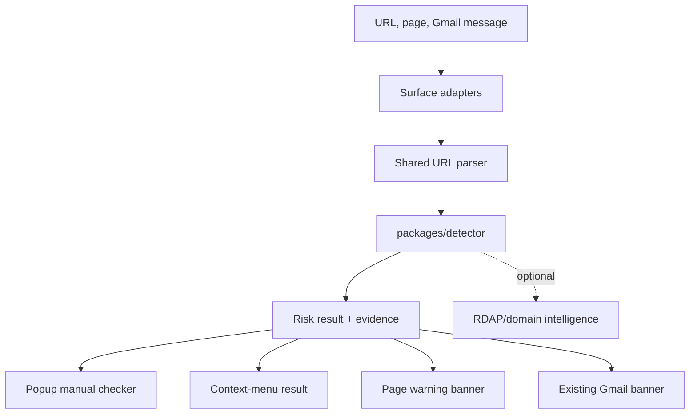
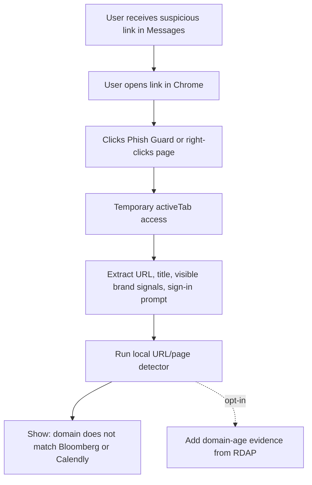

# feat: Add browser link phishing protection

## Summary

Expand Phish Guard from Gmail-only warnings into browser-first phishing protection for suspicious links and pages. V2 should warn on sketchy web pages, let users check pasted links from texts or DMs, and keep Gmail protection working through the same local detector pipeline.

---

## Problem Frame

The Bloomberg/Calendly incident shows the next product gap. The phishing attempt started outside Gmail, in a message thread, then pushed the user to a fake Calendly-like site at `calendly.bloombergpartner.net`. V1 would miss it because it only runs inside Gmail.

The useful v2 product is not "read every app." A Chrome extension cannot safely inspect Messages, DMs, or arbitrary native app surfaces. The practical v2 is browser-first: when a user lands on a suspicious page, right-clicks a suspicious link, or pastes a URL copied from another app, Phish Guard explains the risk before the user signs in or schedules.

This changes the privacy boundary. Local URL and page heuristics can stay in-browser, but live domain age checks need network calls to registration-data services. The plan keeps those as an explicit opt-in layer rather than silently weakening the current local-first promise.

---

## Scope Boundaries

### In scope

- Browser page warnings for suspicious current pages after user interaction or granted site access.
- Manual URL checker in the popup for links copied from texts, DMs, Slack, or email.
- Context-menu checks for links, selected text, and the current page.
- Detector support for URL/page impersonation evidence, not just email sender evidence.
- Optional live domain intelligence for domain age and registration signals.
- Privacy and store-copy updates that clearly separate local checks from optional network checks.

### Deferred for later

- Native Messages, WhatsApp, Instagram DM, or X DM scanning.
- Screenshot OCR as an input surface.
- Backend reputation scoring or telemetry.
- Automatic blocking/interstitials before navigation.
- A full brand-claim ML model.

### Outside this product's identity

- Saying a site is definitely malicious when evidence only supports "suspicious."
- Submitting URLs or page content to third-party AI services by default.
- Requesting `<all_urls>` page access as the default install path.

---

## Requirements

**User experience**

- R1. Users can paste a URL into the popup and get a clear risk explanation without granting broad website access.
- R2. Users can right-click a link, selected text, or page and run a Phish Guard check from the browser context menu.
- R3. When the user checks the active page, Phish Guard can show a warning banner or side panel explaining suspicious evidence.
- R4. The Bloomberg/Calendly example warns because the registrable domain is `bloombergpartner.net`, while the page and path imply Bloomberg and Calendly.
- R5. The UI must distinguish "be careful" from "confirmed phishing" and show the strongest 2-4 evidence items.

**Detection**

- R6. The detector supports URL-only inputs with destination URL, visible link text, selected text, page title, and optional page snippets.
- R7. The detector identifies brand-in-domain and brand-in-page mismatches such as `calendly.bloombergpartner.net` presenting as Bloomberg or Calendly.
- R8. The detector normalizes URLs through a shared parser that extracts protocol, hostname, registrable domain, subdomain labels, path, and query signals.
- R9. Local heuristics flag URL shorteners, punycode, misleading subdomains, login/oauth prompts, invite/scheduling language, and suspicious brand combinations.
- R10. Optional live intelligence can add domain age and registration evidence without changing the local-only default.

**Privacy and permissions**

- R11. The default install should avoid `<all_urls>`, `history`, `tabs`, `webRequest`, cookies, and page capture permissions.
- R12. Page checks should use `activeTab` and `scripting` after a user gesture when possible.
- R13. Context-menu checks should use URL or selection data directly before injecting into the page.
- R14. Any live domain intelligence must be disclosed as contacting public registration services with the domain being checked.
- R15. Gmail protection must remain optional and scoped to `https://mail.google.com/*`.

**Quality and launch**

- R16. Existing Gmail tests and detector corpus evaluations must keep passing.
- R17. Tests must cover phishing, safe, limited-evidence, and delegated-platform cases for URL/page inputs.
- R18. README, privacy policy, popup copy, and store packet must describe browser link protection without overstating coverage.

---

## Key Technical Decisions

- KTD1. Browser-first v2, not native-app scanning: Chrome can protect the page the user opens and let them paste links from Messages, which is shippable without OS-level access.
- KTD2. Reuse the detector package with new input types: keep `packages/detector` platform-neutral, and add URL/page analysis beside `analyzeMessage`.
- KTD3. Use `activeTab` for current-page checks: Chrome documents `activeTab` as temporary access after a user gesture, which avoids persistent all-site access for the core feature.
- KTD4. Add `contextMenus` for user-initiated link checks: Chrome exposes `linkUrl`, `pageUrl`, and `selectionText` to context-menu handlers, which fits the "check this suspicious thing" interaction.
- KTD5. Keep live domain age optional: RDAP provides machine-readable registration data, but fetching it sends the checked domain to an outside service.
- KTD6. Do not use `declarativeNetRequest` for v2 warnings: it is useful for declarative blocking/modification, but this product needs explanation and evidence before blocking.
- KTD7. Prefer a side panel for detailed results and an inline banner for urgent page risk: popup is good for paste checks, while page-level warnings need persistent explanation after the popup closes.

---

## High-Level Technical Design

---

## Implementation Units

### U1. Add shared URL and page analysis primitives

**Goal:** Give the detector a platform-neutral way to analyze suspicious URLs and page claims.

**Requirements:** R4, R6, R7, R8, R9, R17

**Files:**

- `packages/detector/src/url-analysis.ts`
- `packages/detector/src/domain-match.ts`
- `packages/detector/src/brand-rules.ts`
- `packages/detector/src/evidence.ts`
- `packages/detector/src/index.ts`
- `packages/detector/tests/url-analysis.test.ts`
- `packages/detector/fixtures/corpus/phishing.json`
- `packages/detector/fixtures/corpus/safe.json`
- `scripts/evaluate-detector-corpus.mjs`

**Approach:** Add an `analyzeUrl` or `analyzePage` entry point that accepts URL, visible link text, selected text, page title, and optional visible page text. Keep this separate from `analyzeMessage` so Gmail email evidence does not leak into browser-page assumptions. Reuse `domainMatchesAny`, brand rules, shortener rules, and lookalike-domain companion words where possible.

**Test scenarios:**

- `https://calendly.bloombergpartner.net/` with page text claiming Bloomberg and Calendly returns `suspicious`.
- `https://scheduling.bloomberg.com/` with Bloomberg scheduling text returns `safe` or `limited_evidence`.
- `https://calendly.com/example/30min` with neutral invite text does not warn solely because it is a scheduling page.
- Punycode or mixed-script domains return warning evidence.
- A URL shortener with no visible brand claim returns `limited_evidence`, not a strong warning.
- A trusted brand subdomain passes when it matches an explicit brand rule.

**Verification:** `npm test -- packages/detector/tests/url-analysis.test.ts` and `npm run eval:detector`.

### U2. Add manual URL checker to the popup

**Goal:** Let users check links copied from Messages, DMs, or any app without granting broad page access.

**Requirements:** R1, R5, R6, R11, R14, R18

**Files:**

- `apps/chrome-extension/src/popup/popup.html`
- `apps/chrome-extension/src/popup/popup.ts`
- `apps/chrome-extension/tests/popup-url-checker.test.ts`
- `apps/chrome-extension/tests/permission-flow.test.ts`
- `apps/chrome-extension/tests/store-readiness.test.ts`
- `PRIVACY.md`

**Approach:** Add a compact input field and "Check link" action to the existing popup. Run local analysis immediately. If live domain intelligence is disabled, show a local-only explanation. If enabled, show a second "Check domain age" action with privacy copy before making any network request.

**Test scenarios:**

- Pasting the Bloomberg/Calendly URL shows a suspicious result with registrable-domain mismatch evidence.
- Pasting a malformed URL shows a clear "could not parse" state.
- Pasting a known safe URL shows a calm safe/limited-evidence state.
- Manual checking does not request Gmail permission.
- The popup remains usable at 352px width with long URLs and long domains.

**Verification:** `npm test -- apps/chrome-extension/tests/popup-url-checker.test.ts`.

### U3. Add context-menu checks for links, selected text, and pages

**Goal:** Make "check this suspicious thing" one right-click away.

**Requirements:** R2, R5, R6, R11, R12, R13

**Files:**

- `apps/chrome-extension/manifest.json`
- `apps/chrome-extension/src/background/context-menu.ts`
- `apps/chrome-extension/src/background/service-worker.ts`
- `apps/chrome-extension/src/background/permissions.ts`
- `apps/chrome-extension/tests/context-menu.test.ts`
- `apps/chrome-extension/tests/manifest-permissions.test.ts`

**Approach:** Add the `contextMenus` permission and register menu items for link, selection, page, and action contexts. For link checks, use `info.linkUrl` without injecting content. For selected text, extract the first URL-like token. For page checks, use `pageUrl` first and escalate to `activeTab` only when page title or visible text is needed.

**Test scenarios:**

- Right-clicking a link analyzes `linkUrl` without requesting host permission.
- Right-clicking selected text containing a URL extracts and analyzes that URL.
- Right-clicking a page analyzes `pageUrl` and opens the result UI.
- Manifest tests allow `contextMenus` and `activeTab` but still fail on `<all_urls>`, `history`, `tabs`, `webRequest`, cookies, and `pageCapture`.
- Service worker initialization is idempotent when Chrome restarts the worker.

**Verification:** `npm test -- apps/chrome-extension/tests/context-menu.test.ts apps/chrome-extension/tests/manifest-permissions.test.ts`.

### U4. Add current-page risk extraction and warning UI

**Goal:** Warn when a user lands on a page that appears to impersonate a brand or trusted workflow.

**Requirements:** R3, R4, R5, R7, R9, R12, R17

**Files:**

- `apps/chrome-extension/src/content/page-content.ts`
- `apps/chrome-extension/src/content/page-dom.ts`
- `apps/chrome-extension/src/ui/page-warning.ts`
- `apps/chrome-extension/src/ui/page-warning.css`
- `apps/chrome-extension/tests/page-dom.test.ts`
- `apps/chrome-extension/tests/page-warning.test.ts`
- `apps/chrome-extension/tests/content-integration.test.ts`

**Approach:** Add a page adapter that reads a bounded set of visible signals after a user-triggered check: URL, title, headings, visible button text, favicon alt data where accessible, and link/button labels near sign-in or scheduling flows. Do not scrape full page text by default. Render a page warning near the top of the page or open a side-panel-style result if injecting a banner would be too intrusive.

**Test scenarios:**

- A fake Calendly/Bloomberg fixture with "Sign In with X" and scheduling copy warns.
- A legitimate scheduling page fixture does not warn merely because it asks for sign-in.
- A page with no brand claim and a suspicious-looking domain returns limited evidence.
- Warning UI renders once, updates in place, and removes cleanly after a new check.
- Long domains wrap without overflowing the banner.

**Verification:** `npm test -- apps/chrome-extension/tests/page-dom.test.ts apps/chrome-extension/tests/page-warning.test.ts apps/chrome-extension/tests/content-integration.test.ts`.

### U5. Add optional domain intelligence provider

**Goal:** Support high-signal evidence like "domain created two days ago" without making network checks the default.

**Requirements:** R10, R14, R17, R18

**Files:**

- `packages/detector/src/domain-intelligence.ts`
- `packages/detector/tests/domain-intelligence.test.ts`
- `apps/chrome-extension/src/background/domain-intelligence.ts`
- `apps/chrome-extension/tests/domain-intelligence.test.ts`
- `docs/privacy/threat-model.md`
- `PRIVACY.md`

**Approach:** Define a small `DomainIntelligenceProvider` interface with inputs and outputs limited to domain-level data. Start with a disabled default provider and fixture-backed tests. If live lookup ships, call RDAP only for the registrable domain after the user opts in. Cache domain-level results locally with a short TTL and never send full URLs, page content, selected text, or email data.

**Test scenarios:**

- Fixture domain created two days ago adds warning evidence.
- Fixture old trusted domain adds neutral evidence.
- Provider failure degrades to local-only results.
- Live lookup path receives only `bloombergpartner.net`, not `https://calendly.bloombergpartner.net/...`.
- Privacy tests fail if URL paths, query strings, selected text, or page body are passed to the provider.

**Verification:** `npm test -- packages/detector/tests/domain-intelligence.test.ts apps/chrome-extension/tests/domain-intelligence.test.ts`.

### U6. Update privacy, README, and store posture for v2

**Goal:** Make the public trust story match the new browser-link surface before shipping.

**Requirements:** R11, R14, R15, R18

**Files:**

- `README.md`
- `PRIVACY.md`
- `docs/privacy/threat-model.md`
- `docs/privacy/permissions.md`
- `docs/store/chrome-web-store-submission.md`
- `docs/store/dashboard-answers.md`
- `apps/chrome-extension/tests/store-readiness.test.ts`

**Approach:** Update copy from "inside Gmail" to "inside Gmail and suspicious browser links" only after the feature exists. Add permission copy for `activeTab` and `contextMenus`. If live RDAP is enabled, explain that domain-only checks contact public registration services and can be turned off.

**Test scenarios:**

- Store-readiness test asserts README mentions Gmail and browser link checks after v2 ships.
- Store-readiness test asserts privacy docs name each permission and data boundary.
- Privacy boundary tests assert Gmail protection remains scoped to `mail.google.com`.
- Manual review confirms the README does not imply native Messages or DM scanning.

**Verification:** `npm test -- apps/chrome-extension/tests/store-readiness.test.ts apps/chrome-extension/tests/privacy-boundary.test.ts`.

---

## Acceptance Examples

- AE1. Bloomberg/Calendly text scam: Given a user opens `https://calendly.bloombergpartner.net/`, when they run Phish Guard on the page, then the result warns that the page claims trusted scheduling/brand context but the registrable domain is `bloombergpartner.net`.
- AE2. Paste-only check: Given the same URL copied from Messages, when the user pastes it into the popup, then Phish Guard warns without asking for Gmail or all-site access.
- AE3. Legit scheduling link: Given a normal Calendly link on `calendly.com`, when checked, then Phish Guard does not warn solely because the page is a calendar invite.
- AE4. Local-only mode: Given live domain intelligence is off, when a user checks a suspicious URL, then the result uses only local evidence and does not contact RDAP or other external services.
- AE5. Live domain intelligence: Given the user enables domain-age checks, when a suspicious registrable domain is newly registered, then the result includes domain-age evidence and labels it as an external lookup.
- AE6. Gmail regression: Given a suspicious Gmail message, when Gmail warnings are enabled, then the existing inline Gmail banner still appears and does not depend on the browser-link feature.

---

## System-Wide Impact

The main impact is the permission and privacy model. V1 only asks for optional Gmail host access. V2 adds user-triggered browser checks, which should lean on `activeTab`, `contextMenus`, and local popup input rather than broad host permissions. This keeps the extension credible: users get protection beyond Gmail without granting constant access to every site.

The detector also becomes less email-shaped. `MessageMetadata` can remain, but the package should expose a sibling URL/page analysis contract so future inputs such as OCR or reported links do not need to fake email messages.

---

## Risks & Dependencies

- **Permission creep:** Browser protection can tempt `<all_urls>`. Keep broad host access out of v2 unless a later plan proves it is necessary.
- **False positives on legitimate partner domains:** Real brands use agencies and scheduling tools. Require multiple evidence signals before showing a strong warning.
- **Live intelligence availability:** RDAP responses vary by registry and can fail. Treat it as supplemental evidence, not a hard dependency.
- **Chrome Web Store review:** New permissions and network lookups require updated dashboard answers and privacy copy.
- **UI trust:** A warning tool that looks noisy will train users to ignore it. Keep copy short and evidence-based.

---

## Sources / Research

- Existing Gmail extension architecture: `apps/chrome-extension/manifest.json`, `apps/chrome-extension/src/background/permissions.ts`, `apps/chrome-extension/src/content/gmail-content.ts`, `apps/chrome-extension/src/ui/banner.ts`.
- Existing detector architecture: `packages/detector/src/risk-score.ts`, `packages/detector/src/domain-match.ts`, `packages/detector/tests/risk-score.test.ts`.
- Existing privacy boundary: `PRIVACY.md`, `docs/privacy/threat-model.md`.
- Prior consumer Chrome-extension plan: `docs/plans/2026-06-06-002-feat-consumer-inline-phishing-warning-plan.md`.
- Chrome `activeTab` documentation: `https://developer.chrome.com/docs/extensions/develop/concepts/activeTab`.
- Chrome `contextMenus` documentation: `https://developer.chrome.com/docs/extensions/reference/api/contextMenus`.
- Chrome `permissions` documentation: `https://developer.chrome.com/docs/extensions/reference/api/permissions`.
- Chrome `declarativeNetRequest` documentation: `https://developer.chrome.com/docs/extensions/reference/api/declarativeNetRequest`.
- RDAP overview: `https://about.rdap.org/`.
